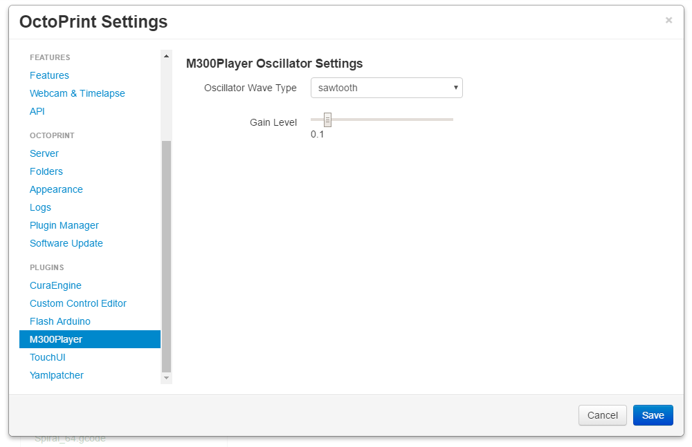

# OctoPrint-M300Player
---
Octoprint plugin to send M300 gcode messages to OctoPrint's web interface using a webkitAudioContext and oscillatorNode on [supported browsers](https://developer.mozilla.org/en-US/docs/Web/API/AudioContext#Browser_compatibility). Tested in Chrome.

**Note:** 
+ This plugin does **NOT** work with files on the SD card.
+ This plugin does **NOT** work in Internet Explorer.

###Setup

Install via the bundled Plugin Manager or manually using this URL:

https://github.com/jneilliii/OctoPrint-M300Player/archive/master.zip